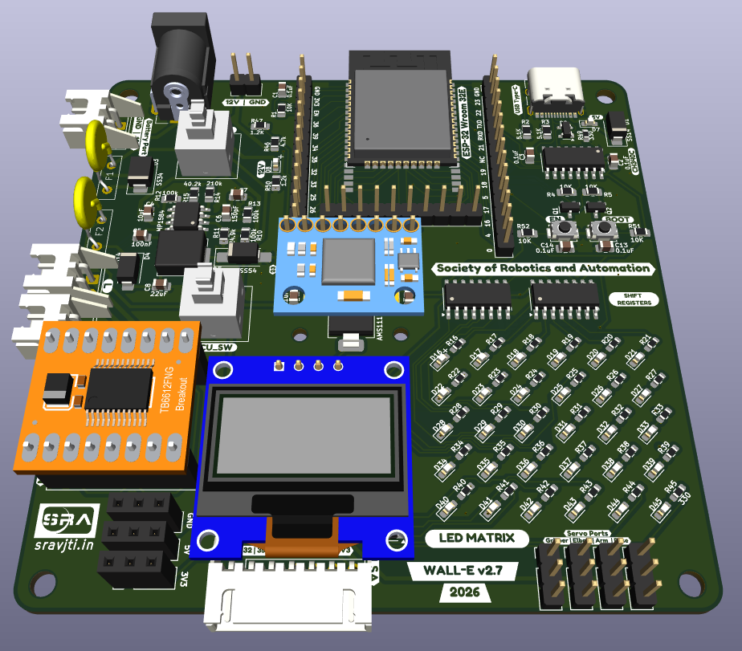
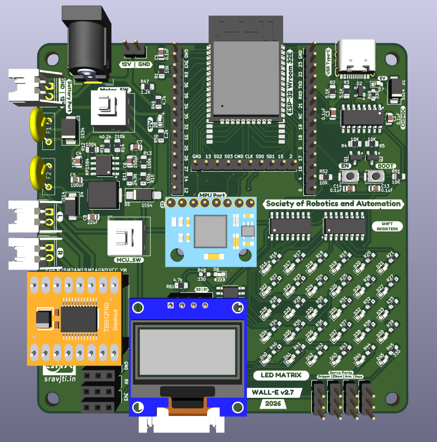
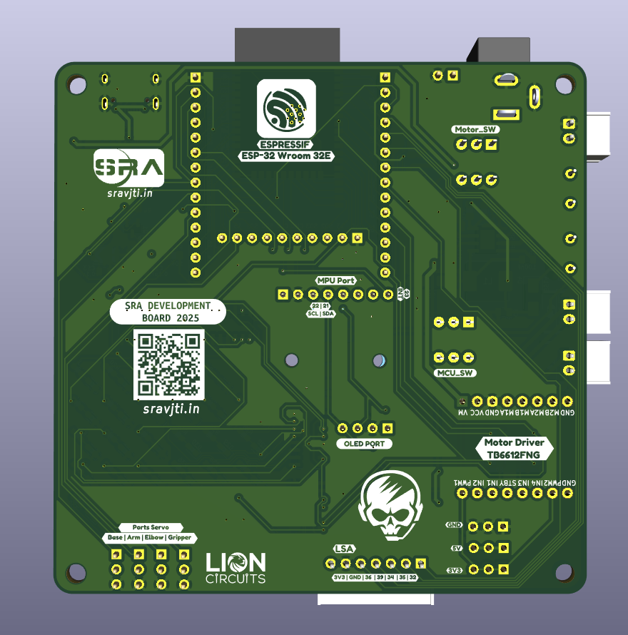
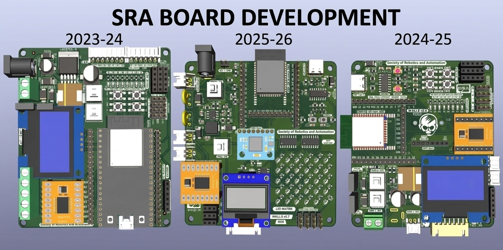

<!-- PROJECT LOGO -->

[![Stargazers][stars-shield]][stars-url]
[![Forks][forks-shield]][forks-url]
[![Issues][issues-shield]][issues-url]
[![License][license-shield]][license-url]

 

  

  <h3 align="center">SRA Development Board</h3>
  

    ESP32-based Development Board
     
    <a href="./sra_dev_board_2026">KiCAD</a>
    ·
    <a href="./gerber_sra_dev_board">Gerber</a>
    ·
    <a href="./documentation/images/board_images/front.png">Images</a>
    ·
    <a href="./3d_models/sra_board_model/sra_dev_board_2026.step">3D Model</a>
  

# SRA Board 2026

The SRA board is a development board based on ESP32 with on-board peripherals like a programmable LED matrix, switches, sensor ports for Line Sensor Array and MPU-6050, protection circuit for over-current and reverse voltage, and motor drivers.

## Table of Contents

- [SRA Board 2026](#sra-board-2026)
  - [Table of Contents](#table-of-contents)
  - [Board Images](#board-images)
  - [About the Project](#about-the-project)
  - [Getting Started with a Development Board](#getting-started-with-a-development-board)
  - [Notable problems in the current SRA Board](#notable-problems-in-the-current-sra-board)
  - [Improvements Suggested for Future Iterations](#improvements-suggested-for-future-iterations)
  - [Potential Future Enhancements](#potential-future-enhancements)
  - [3D Models](#3d-models)
  - [Milestones](#milestones)
  - [Contributors](#contributors)
  - [Acknowledgements and Resources](#acknowledgements-and-resources)
  - [License](#license)

## Board Images

- **Frontside**

  

- **Backside**

  

## About the Project

- This development board is used for the [Wall-E](https://github.com/SRA-VJTI/Wall-E) and [MARIO](https://github.com/SRA-VJTI/MARIO) workshops conducted by [SRA](https://github.com/SRA-VJTI).
- Designed using KiCAD. The schematic and board files are [here](./sra_dev_board_2026).
- Resources for [previous work](https://github.com/SRA-VJTI/sra-board-hardware-design/tree/v2.5). For more details of the SRA board 2024, checkout this [link](https://github.com/SRA-VJTI/sra-board-hardware-design/releases/tag/v2.4).
- The SRA board 2023 images can be found [here](https://github.com/SRA-VJTI/sra-board-hardware-design/tree/v2.3/documentation/images).
- Older versions of the board and miscellaneous designs can be found [here](https://github.com/SRA-VJTI/PCB-Schematics-and-Layouts).

## Getting Started with a Development Board

  

In general, every development board has the following basic features:

- ### Power Supply Unit
  - Microcontrollers (MCUs) usually run on 3.3V or 5V logic supply voltage while input to a development board is normally 12V for motor and driving/controlling peripheral devices.
  - So, in order to have a single input source, a _power_ section which inter converts this 12V to standard levels like 5V & 3.3V for MCU and sensors is present.This is achieved using a step-down [buck regulator](https://www.youtube.com/watch?v=m8rK9gU30v4).
  - Buck Regulator IC [MP1584](./datasheets/MP1584_buck.pdf) is used in the current SRA Board 2026 for stepping down the voltage from 12V to 5V DC. This 5V is further regulated to 3.3V using LDO IC [AMS1117-3.3](./datasheets/ams1117_ldo.pdf). The MP1584 is a more compact and efficient alternative compared to the previous LM2576-S.
  - The previous edition of the SRA board (2025) used the [LM2576-S-5](./datasheets/lm2576_buck_regulator.pdf) buck regulator, while earlier editions used the LM7805 linear voltage regulator for stepping down from 12V to 5V.
  - The older editions of the SRA board used the LD33 linear voltage regulator for converting 5V to 3.3V at the sensor port.

- ### Motor Driver
  - Motors usually run on 12V and MCU output is generally 5V/3.3V. So, an external motor driver circuitry is required to control motors according to the MCU input.
  - The current and previous editions of SRA board use the [TB6612FNG](./datasheets/TB6612FNG_motor_driver.pdf) Motor Driver, which is a MOS-based H-Bridge motor driver.
  - The older editions of SRA Board used the L298N IC for motor-control, which is a BJT-based H-Bridge motor driver.

- ### Sensor Port
  - According to the external sensor types, usually development boards have onboard sensor ports where the sensors can be connected easily. [LSA - Line Sensor Array]() and [MPU- Motion Processing Unit]() have on-board connection ports.
  - The current edition uses easily available and efficient [JST XH connectors](https://en.wikipedia.org/wiki/JST_connector).
  - Previous versions used bulky [FRC connectors](<https://www.sunrom.com/c/frc-idc-flat-cable-box-header#:~:text=FRC%20(Flat%20Ribon%20Cable)%20are,from%206%20to%2064%20pins.>)

- ### Protection against [Reverse Voltage](https://www.google.com/url?sa=t&rct=j&q=&esrc=s&source=web&cd=&cad=rja&uact=8&ved=2ahUKEwjc8aaX1c3rAhXXXSsKHXphBgQQFjABegQICxAD&url=https%3A%2F%2Fwww.ti.com%2Flit%2Fpdf%2Fslva139&usg=AOvVaw0Qbub75JJ986MzLv6FYWKE)
  - The SRA Boards use diodes for reverse voltage protection in the power-line.
  - 12V Motor line and power regulated line have been separated with [SS34](./datasheets/ss34_3A_schottky_diode.pdf) and [SS54](./datasheets/ss24_2A_schottky_diode.pdf) schottky diodes respectively.

- ### Protection against [Over Current](https://www.baypower.com/blog/what-is-overcurrent-protection/#:~:text=Overcurrent%20protection%20is%20the%20method,of%20a%20piece%20of%20equipment.)
  - Earlier, for the overcurrent protection of MCU and motor driver circuit, bulky glass fuses of 300mA and 3A were used respectively. After breakdown, they used to be replaced.
  - In the recent versions of the board, these were replaced with compact, PTC Resettable Fuses.
  - On 12V line - [RXEF160](./datasheets/RUEF160_3,2A_trip_ptc_fuse.pdf) : 1.6A hold current; 3.2A trip current Fuse was used.
  - On 5V line - [RXEF160](./datasheets/RXEF050_1A_trip_ptc_fuse.pdf) : 0.5A hold current; 1A trip current Fuse was used.
- ### Programmable Switches and LEDs
  - Every development board should have some programmable switches and LEDs for testing, control and debugging purposes.
  - The current SRA Board 2026 features a 6x5 LED matrix (30 LEDs total) controlled via shift registers, which provides enhanced debugging capabilities and expressive visual feedback while reducing GPIO usage compared to discrete LEDs.
  - The previous edition (2025) had an array of 8 programmable discrete LEDs and switches.
  - The earlier editions had fewer programmable switches and LEDs for testing and control purposes.

- ### Power Switch
  - All versions have a power switch for the motor driver, using which power supply to the motor driver can be toggled. Similarly, there was a switch for the ESP32 MCU.

> Now that we covered basics of development boards, let us talk about the changes made in the new design.

## Changes IN SRA Board Over the years from 2022-2026

|            Feature            |               SRA Board 2022               |           SRA Board 2023           |           SRA Board 2024           |           SRA Board 2025           |            SRA Board 2026            |
| :---------------------------: | :----------------------------------------: | :--------------------------------: | :--------------------------------: | :--------------------------------: | :----------------------------------: |
|           12V to 5V           |           LM2596 Buck Converter            |      LM2576-S Buck Converter       |      LM2576-S Buck Converter       |      LM2576-S Buck Converter       |        MP1584 Buck Converter         |
|  Reverse Voltage Protection   |                   Diodes                   |               Diodes               |               Diodes               |               Diodes               |                Diodes                |
|   Line Sensing Arrays (LSA)   |                Photodiodes                 |             IR Sensors             |             IR Sensors             |             IR Sensors             |              IR Sensors              |
|     Number of LSA Sensors     |                     4                      |                 5                  |                 5                  |                 5                  |                  5                   |
|         Motor Driver          |                 TB6612FNG                  |             TB6612FNG              |             TB6612FNG              |             TB6612FNG              |              TB6612FNG               |
|     Stepper Motor Driver      |                     -                      |               A4988                |                 -                  |                 -                  |                  -                   |
|   No. of DC Motor Channels    |                     4                      |                 2                  |                 2                  |                 2                  |                  2                   |
| No. of Stepper Motor Channels |                     0                      |                 1                  |                 0                  |                 0                  |                  0                   |
|        No. of Switches        |                     4                      |                 4                  |                 2                  |                 2                  |                  2                   |
|          No. of LEDs          |                     8                      |                 8                  |                 8                  |                 8                  | 6x5 LED Matrix (via Shift Registers) |
|    Over Current Protection    |            PTC Resettable Fuses            |        PTC Resettable Fuses        |        PTC Resettable Fuses        |        PTC Resettable Fuses        |         PTC Resettable Fuses         |
|    Sensor Port Connectors     | JST (Japan Solderless Terminal) Connectors |           JST Connectors           |           JST Connectors           |           JST Connectors           |            JST Connectors            |
| Component Type and Board Size |     SMD(Surface Mount Device), Smaller     | SMD(Surface Mount Device), Smaller | SMD(Surface Mount Device), Smaller | SMD(Surface Mount Device), Smaller |  SMD(Surface Mount Device), Smaller  |
|         ESP32 Module          |               Not Integrated               |           Not Integrated           |           Not Integrated           |    Mounted and Soldered to PCB     |     Mounted and Soldered to PCB      |
|         Flashing Port         |                 Micro USB                  |             Micro USB              |             Micro USB              |               Type-C               |                Type-C                |

- ### **Compatiblity of SRA Board with Battery [3- 3.3V 2500mAh Batteries](https://robu.in/product/bak-nmc-18650-2500mah-8c-lithium-ion-battery/?gad_source=1&gclid=Cj0KCQjw6PGxBhCVARIsAIumnWb20iyJUEXE8V6eAfSambP35PfBsSFKje-ALjyNniqGYCW_kz3IbcQaAoeGEALw_wcB)**
  - The SRA Board is compatible with **3-cell (3S) Lithium-ion battery packs** which use an external **[BMS (Battery Management System)](https://robu.in/product/3s-10a-12v-18650-lithium-battery-charger-board-protection-module/)**.
  - The BMS helps maintain safe operating voltages and disconnects the battery when the voltage drops below a safe limit.
  - It also ensures balanced charging and discharging of the three cells, improving the overall health and lifetime of the battery pack.

- ### **7805 (5V linear regulator) to [LM2576/96 Buck Convertor](https://www.youtube.com/watch?v=m8rK9gU30v4)**
  - The higher efficiency, output current capability and reliability of LM2576/96 were the primary reasons for this change.
  - The efficiency of LM2576 can reach up to **~92%**, which is significantly better than the 7805 linear regulator.
  - The LM2576 can provide currents up to **3A**, allowing peripherals such as the MARIO workshop manipulator to be powered using the onboard regulator.

- ### **LD33 (3.3V) to [AMS1117](http://www.advanced-monolithic.com/pdf/ams1117.pdf)**:
  - Older editions used the **LD33 IC** to step down from 5V to 3.3V.
  - This was later replaced with the **AMS1117-3.3 LDO**, which is more compact and widely used for stable 3.3V regulation.
  - (_AMS1117 is also used on the ESP32-DevKitC V4 module._)

- ### **Reverse voltage protection: Diodes to P-MOSFET**
  - Diodes placed in series with the power line introduce voltage drop and power loss compared to a **P-MOSFET based protection circuit**.
  - Due to the higher current requirements of the motors, managing diode size and current rating became difficult.
  - Therefore, earlier versions used a **P-MOSFET based reverse polarity protection circuit**, which is more efficient and can handle higher currents.
  - In the current edition, **SMD Schottky diodes** are used, making size and rating less of an issue.

- ### **Component Type and Board Size**:
  - In the previous editions, THT/PTH (Through-Hole) components were used, which occupied more board area and increased in size with higher power ratings.
  - In the current edition, the design adopts a more compact SMD-based layout. The LM2576 buck converter has been replaced with the smaller MP1584 regulator, and the discrete LED array has been replaced with a 6×5 LED matrix driven using shift registers.
  - Current Board Dimensions: **90mm x 90mm**

- ### **L298N vs [TB6612FNG](https://dronebotworkshop.com/tb6612fng-h-bridge/)**
  - L298N is a BJT-based H-bridge motor driver but it is less efficient as compared to the new MOS-based TB6612FNG.
  - The detailed comparison is shown below. As you can see the efficiency of TB6612FNG can reach up to 91-95% which is significantly higher than the 40-70% efficiency of L298N.
  - The only drawback of TB6612FNG is the less continuous current which is equal to 1.2A.
    

        
    

- ### **LED System**

  - Earlier versions of the board used a set of discrete programmable LEDs for debugging and status indication. In the SRA Board 2026, this has been replaced with a **6×5 LED matrix driven using shift registers**.  
  - This significantly reduces GPIO usage while allowing more flexible visual debugging and status indication patterns.

## Notable problems in the current SRA Board

- ### **Buck Converter Stability Issue (MP1584)**
  - The SRA Board 2026 uses the **MP1584 buck converter** to step down 12V to 5V.
  - While the device allowed a significant reduction in the power section size compared to LM2576, irregular behaviour was observed under **higher load conditions**.
  - During heavy load scenarios involving motors and other peripherals, the **5V rail occasionally showed instability**, which may affect the overall system reliability.

- ### **USB Type-C Connector Mechanical Strength Issue**
  - The board currently uses a **16-pin USB Type-C connector** for programming and power.
  - In practical usage, the connector was found to be **mechanically weak**, and in some cases it could loosen or detach from the PCB after repeated cable insertion or mechanical stress.

- ### **Power Switch Issue**
  - There are two dpdt power toggle switch used on board. One to toggle the supply of 12v to the whole board and one to toggle the supply of 5v to the logic circuit.
  - Instead it should have been toggling 12v supply to the motors and toggling 12v supply to the whole board.

## Improvements Suggested for Future Iterations

Based on the current design of the SRA Board 2026, the following improvements are recommended for future iterations:

- **Replace MP1584 with TPS562202**: The TPS562202 offers improved reliability and enhanced long-term robustness compared to the current MP1584 buck converter. This component provides better thermal performance and more stable regulation across varying load conditions.

- **Upgrade to USB-C 6P Connector**: Replace the current Type-C connector with a robust USB-C 6P connector configuration. This simplifies soldering procedures, improves mechanical strength, and enhances durability during repeated connection cycles.

- **Add Unconnected UART Solder Pads (RX, TX)**: Incorporate unconnected solder pads for UART receive and transmit lines on the PCB. This allows the board to optionally function as a USB-to-TTL interface, extending its utility beyond standalone development applications.

## Potential Future Enhancements

The following experimental features and enhancements are being considered for future versions of the SRA Board but are not yet integrated into the 2026 iteration:

- **Onboard IMU Integration**: Direct integration of an Inertial Measurement Unit (IMU) for advanced motion sensing applications, eliminating the need for external MPU6050 connections.

- **Camera FFC/FPC Connector**: Addition of a Flat Flex Cable (FFC) or Flexible Printed Circuit (FPC) connector to support camera modules, enabling vision-based robotics projects and computer vision applications.

- **Integrated Motor Driver**: Direct onboarding of motor driver circuits instead of requiring external TB6612FNG modules, reducing component count and improving form factor.

- **CH340 to CP2102 Upgrade**: Replacing the CH340 USB-to-UART bridge with CP2102 for improved reliability, driver support across multiple operating systems, and better stability in industrial environments.

These enhancements represent opportunities for evolution of the platform and will be explored as future iterations of the board are developed.

## 3D Models

1. The complete 3D model (.step) file of [SRA Board 2026](./3d_models/sra_board_model/sra_dev_board_2026.step)
2. The 3D models of motor driver, LEDs, ESP32 etc.: [3d models of other components](./3d_models/)

<!-- Milestone -->

## Milestones

- [x] Designing of the prototype board
- [x] Modular testing of the circuit
- [x] Testing of prototype board
- [x] Final version
- [x] Making the board Battery Compatible
- [x] Onboard ESP32 Module

<!-- CONTRIBUTORS -->

## Contributors

- [Vishal Mutha](https://github.com/Vishal-Mutha): _Designer_
- [Atharva Atre](https://github.com/AtharvaAtre): _Mentor_
<!-- ACKNOWLEDGEMENTS AND REFERENCES -->

## Acknowledgements and Resources

- Previous Edition: [SRA Board 2025](https://github.com/SRA-VJTI/sra-board-hardware-design/releases/tag/v2.5)
- [KiCAD Tutorials](https://www.youtube.com/playlist?list=PL3bNyZYHcRSUhUXUt51W6nKvxx2ORvUQB)
- [README Template](https://github.com/roshanlam/ReadMeTemplate) by [roshanlam](https://github.com/roshanlam)

## License

- Distributed under the [MIT License](https://github.com/SRA-VJTI/sraboard-hardware-design/blob/master/LICENSE).

[forks-shield]: https://img.shields.io/github/forks/SRA-VJTI/sra-board-hardware-design
[forks-url]: https://github.com/SRA-VJTI/sra-board-hardware-design/network/members
[stars-shield]: https://img.shields.io/github/stars/SRA-VJTI/sra-board-hardware-design
[stars-url]: https://github.com/SRA-VJTI/sra-board-hardware-design/stargazers
[issues-shield]: https://img.shields.io/github/issues/SRA-VJTI/sra-board-hardware-design
[issues-url]: https://github.com/SRA-VJTI/sra-board-hardware-design/issues
[license-shield]: https://img.shields.io/github/license/SRA-VJTI/sra-board-hardware-design
[license-url]: https://github.com/SRA-VJTI/sra-board-hardware-design/blob/master/LICENSE
