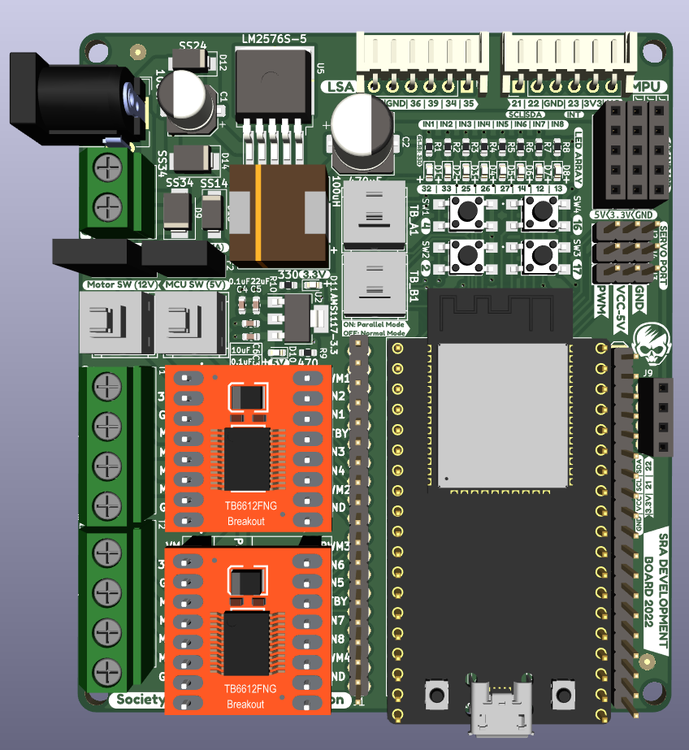

<!-- PROJECT LOGO -->
[![Stargazers][stars-shield]][stars-url]
[![Forks][forks-shield]][forks-url]
[![Issues][issues-shield]][issues-url]
[![License][license-shield]][license-url]

 

  

  <h3 align="center">SRA Development Board</h3>
  

    ESP32-based Development Board
     
    <a href="https://github.com/SRA-VJTI/sra-board-hardware-design/tree/master/sra_dev_board_2022">KiCAD</a>
    ·
    <a href="https://github.com/SRA-VJTI/sra-board-hardware-design/tree/master/gerber_files">Gerber</a>
    ·
    <a href="https://github.com/SRA-VJTI/sra-board-hardware-design/blob/master/documentation/images/sra_board_images.md#sra-board-2020-images">Images</a>
    ·
    <a href="https://a360.co/3c1Rjyv">3D Model</a>
  

# SRA Board 2023-24

The SRA board is a development board based on ESP32 with on-board peripherals like programmable LEDs, switches, sensor ports for Line Sensor Array and MPU-6050, protection circuit for over-current and reverse voltage and motor drivers.

## Table of Contents
- [SRA Board 2023-24](#sra-board-2023-24)
  - [Table of Contents](#table-of-contents)
  - [Board Images](#board-images)
  - [About the Project](#about-the-project)
  - [Getting Started with a Development Board](#getting-started-with-a-development-board)
  - [Major Changes for 2023-24](#major-changes-for-2023-24)
  - [Notable problems in the previous SRA Boards (2019)](#notable-problems-in-the-previous-sra-boards-2019)
  - [Notable problems in the current SRA Board 2023](#notable-problems-in-the-current-sra-board-2023)
  - [3D Models](#3d-models)
  - [Milestones](#milestones)
  - [Contributors](#contributors)
  - [Acknowledgements and Resources](#acknowledgements-and-resources)
  - [License](#license)

## Board Images
- **Frontside**

  

- **Backside**

  

- **Pinout**

  

## About the Project

- This development board is used for the [Wall-E](https://github.com/SRA-VJTI/Wall-E) and [MARIO](https://github.com/SRA-VJTI/MARIO) workshops conducted by [SRA](https://github.com/SRA-VJTI).
- Designed using KiCAD. The schematic and board files are [here](https://github.com/SRA-VJTI/sra-board-hardware-design/tree/master/sra_dev_board_2022).
- Resources for [previous work](https://github.com/SRA-VJTI/sra-board-hardware-design/tree/v2.2).  For more details of the SRA board 2020, checkout this [link](https://github.com/SRA-VJTI/sra-board-hardware-design/tree/v2.2/documentation).
- The SRA board 2020 images can be found [here](https://github.com/SRA-VJTI/sra-board-hardware-design/tree/v2.2/documentation/images).
- Older versions of the board and miscellaneous designs can be found [here](https://github.com/SRA-VJTI/PCB-Schematics-and-Layouts).

## Getting Started with a Development Board

  

In general, every development board has the following basic features:

- ### Power Supply Unit
  - Microcontrollers (MCUs) usually run on 3.3V or 5V logic supply voltage while input to a development board is normally 12V for motor and driving/controlling peripheral devices.
  - So, in order to have a single input source, a *power* section which inter converts this 12V to standard levels like 5V & 3.3V for MCU and sensors is present.This is achieved using a step-down [buck regulator](https://www.youtube.com/watch?v=m8rK9gU30v4).
  - Buck Regulator IC [LM2576-S-5](./datasheets/lm2576_buck_regulator.pdf) is used for stepping down the voltage from 12V to 5V DC. This 5V is further regulated to 3.3V using LDO IC [AMS1117-3.3](./datasheets/ams1117_ldo.pdf).
  - The previous edition of the SRA board (2022-23) used a similar buck regulator setup.
  - The older editions of the SRA board used the LM7805 linear voltage regulator, for stepping down from 12V to 5V; this powered the ESP32. Further, this 5V was converted to 3.3V using the LD33 linear voltage regulator, used by the sensor port.

- ### Motor Driver
    - Motors usually run on 12V and MCU output is generally 5V/3.3V. So, an external motor driver circuitry is required to control motors according to the MCU input.
    - The current and previous editions of SRA board use the [TB6612FNG](./datasheets/TB6612FNG_motor_driver.pdf) Motor Driver, which is a MOS-based H-Bridge motor driver.
    - The older editions of SRA Board used the L298N IC for motor-control, which is a BJT-based H-Bridge motor driver.

- ### Sensor Port
    - According to the external sensor types, usually development boards have onboard sensor ports where the sensors can be connected easily. [LSA - Line Sensor Array]() and [MPU- Motion Processing Unit]() have on-board connection ports.
    - The current edition uses easily available and efficient [JST XH connectors](https://en.wikipedia.org/wiki/JST_connector).
    - Previous versions used bulky [FRC connectors](https://www.sunrom.com/c/frc-idc-flat-cable-box-header#:~:text=FRC%20(Flat%20Ribon%20Cable)%20are,from%206%20to%2064%20pins.)

- ### Protection against [Reverse Voltage](https://www.google.com/url?sa=t&rct=j&q=&esrc=s&source=web&cd=&cad=rja&uact=8&ved=2ahUKEwjc8aaX1c3rAhXXXSsKHXphBgQQFjABegQICxAD&url=https%3A%2F%2Fwww.ti.com%2Flit%2Fpdf%2Fslva139&usg=AOvVaw0Qbub75JJ986MzLv6FYWKE)
    - The SRA Boards use diodes for reverse voltage protection in the power-line.
    - 12V Motor line and power regulated line have been separated with [SS34](./datasheets/ss34_3A_schottky_diode.pdf) and [SS24](./datasheets/ss24_2A_schottky_diode.pdf) schottky diodes respectively.

- ### Protection against [Over Current](https://www.baypower.com/blog/what-is-overcurrent-protection/#:~:text=Overcurrent%20protection%20is%20the%20method,of%20a%20piece%20of%20equipment.)
    - Earlier, for the overcurrent protection of MCU and motor driver circuit, bulky glass fuses of 300mA and 3A were used respectively. After breakdown, they used to be replaced.
    - In the recent versions of the board, these were replaced with compact, PTC Resettable Fuses.
    - On 12V line - [RXEF160](./datasheets/RUEF160_3,2A_trip_ptc_fuse.pdf) : 1.6A hold current; 3.2A trip current Fuse was used.
    - On 5V line - [RXEF160](./datasheets/RXEF050_1A_trip_ptc_fuse.pdf) : 0.5A hold current; 1A trip current Fuse was used.
- ### Programmable Switches and LEDs
    - Every development board should have some programmable switches and LEDs for testing, control and debugging purposes.
    - The current editions has an array of 8 programmable LEDs and switches.
    - The previous edition had a pair of programmable switches and programmable LEDs each.

- ### Power Switch
    - All versions have a power switch for the motor driver, using which power supply to the motor driver can be toggled. Similarly, there was a switch for the ESP32 MCU.

> Now that we covered basics of development boards, let us talk about the changes made in the new design. 

## Major Changes IN SRA Board Over the years from 2020-2024
| Feature  |  SRA Board 2020-21  | SRA Board 2021-22 | SRA Board 2022-23 | SRA Board 2023-24 |
|:----:|:-------:| :-----: | :-----: | :-----: |
|[12V to 5V](#7805-5v-linear-regulator-to-lm2596-buck-convertor)  | LM2596 Buck Convertor | LM2596 Buck Converter | LM2576-S Buck Converter | LM2576-S Buck Converter |
|[5V to 3.3V](#ld33-33v-to-ams1117)| AMS1117-3.3 | AMS1117-3.3 | AMS1117-3.3 | AMS1117-3.3 |
|[Reverse Voltage Protection](#reverse-voltage-protection-diodes-to-p-mosfet) | P-MOSFET | Diodes | Diodes | Diodes |
|[Line Sensing Arrays (LSA)](#lsa_2023) | Photodiodes| Photodiodes| IR Sensors| IR Sensors |
|[Number of LSA Sensors](#num_of_sensors)| 4| 4| 5| 5 |
|[Motor Driver](#l298n-to-tb6612fng)| TB6612FNG| TB6612FNG | TB6612FNG | TB6612FNG  |
| [Stepper Motor Driver](#stepper-motor-driver-port-a4988) | - | - | A4988 | - |
|[No. of DC Motor Channels](#motor-driver-modes)|4|4|2|2|
|[No. of Stepper Motor Channels](#stepper-motor-driver-port-a4988)|0|0|1|1|
|[No. of Switches](#moving-back-to-the-vintage-bar-graph-leds-and-more-switches)|4|4|4|2|
|[No. of LEDs](#moving-back-to-the-vintage-bar-graph-leds-and-more-switches)|8|8|8|8|
|[Over Current Protection](#protection-against-over-current)  | Bulky Glass Fuses | PTC Resettable Fuses | PTC Resettable Fuses| PTC Resettable Fuses|
|[Sensor Port Connectors](#protection-against-over-current)  | JST (Japan Solderless Terminal) Connectors | JST (Japan Solderless Terminal) Connectors | JST Connectors | JST Connectors |
|[Component Type and Board Size](#component-type-and-board-size)  | THT (Through Hole), Big | SMD(Surface Mount Device), Smaller | SMD(Surface Mount Device), Smaller| SMD(Surface Mount Device), Smaller|
- ### **Compatiblity of SRA Board with Battery [3- 3.3V 2500mAh Batteries](https://robu.in/product/bak-nmc-18650-2500mah-8c-lithium-ion-battery/?gad_source=1&gclid=Cj0KCQjw6PGxBhCVARIsAIumnWb20iyJUEXE8V6eAfSambP35PfBsSFKje-ALjyNniqGYCW_kz3IbcQaAoeGEALw_wcB)**
    - This years SRA Board(2023-24) is compatible with batteries which have an external **[BMS(Battery Management System)](https://robu.in/product/3s-10a-12v-18650-lithium-battery-charger-board-protection-module/)**.
    - The BMS helps in maintaining an optimal voltage and disconnects itself when battery voltage drops below a significant voltage.
    - ALso the BMS helps in equal charging and discharging of 3 cells being used as a battery unit and thus helping in increasing the life/health of the battery.
    - ### **7805 (5V linear regulator) to [LM2576/96 Buck Convertor](https://www.youtube.com/watch?v=m8rK9gU30v4)**
    - The greater efficiency, output current and reliability of LM2576/96 were the reasons for this change.
    - The efficiency of LM2576 is up to 92% which is significantly better than 7805. The LM2576 can provide current up to 3A, so  the MARIO workshop manipulator can now be run using onboard regulator.
- ### **LD33 (3.3V) to [AMS1117](http://www.advanced-monolithic.com/pdf/ams1117.pdf)**:
    - The older editions used the LD33 IC to step down from 5V to 3.3V; several discussions resulted in the shift to more compact, reliable AMS1117-3.3(SOT-23) linear voltage regulator. (_AMS1117 is also used on-board on the ESP32-DevKitC V4 module_)

- ### **Reverse voltage protection: Diodes to P-MOSFET**
    - Diodes in series to the power line are inefficient as compare to a P-MOSFET. Dut to the usage of high-rated motors, it was difficult to manage the diode size and the current rating. (_As the current rating of diode increases, its size also increases._)So, the previous version uses the P-MOSFET instead of a diode, which is more efficient and can handle more current.
    - In the current edition, SMD diodes are used, hence rating and size is no longer an issue.

- ### **Component Type and Board Size**:
    - In the previous and older editions, THT or PTH(Plated through hole) components were used, which take up a lot of space and their size increases with increasing rating.
    - In the current edition, the component layout is changed,stepper motor driver is removed and the board is made battery compatible necessary changes for the same where done.
    - Current Board Dimensions: **81mm x 92.68mm**

- ### **L298N to [TB6612FNG](https://dronebotworkshop.com/tb6612fng-h-bridge/)**
    - L298N is a BJT-based H-bridge motor driver but it is less efficient as compared to the new MOS-based TB6612FNG.
    - The detailed comparison is shown below. As you can see the efficiency of TB6612FNG can reach up to 91-95% which is significantly higher than the 40-70% efficiency of L298N.
    - The only drawback of TB6612FNG is the less continuous current which is equal to 1.2A.
    
    

        
    

- ### **Stepper Motor Driver Port ([A4988](https://www.tme.eu/Document/25459777e672c305e474897eef284f74/POLOLU-2128.pdf))**
    - In the Previous and older editions, there were two ports for TB6612FNG Motor Drivers but **it has been updated to one TB6612FNG and one A4988 Stepper Motor Driver in the current SRA Board (2023).** 
    - A4988 Stepper Motor Driver **a microstepping driver for controlling bipolar stepper motors** which has built-in translator for easy operation. This means that we can control the stepper motor with just 2 pins from our controller, or one for controlling the rotation direction and the other for controlling the steps.
    - The Driver provides five different step resolutions: full-step, haft-step, quarter-step, eight-step and sixteenth-step. Also, it has a potentiometer for adjusting the current output, over-temperature thermal shutdown and crossover-current protection.
    

        
    

- ### **Motor Driver Modes**
    - The new edition has 1x TB6612FNG motor drivers which allow a maximum of 2 motors to be controlled. This motor driver is characterized by its operation in two modes - **Normal mode** and **Parallel mode**:   
        1. **Normal Mode**
         
        

        
        

        -  As discussed earlier, the new design has two motor drivers. 1x TB6612FNG and 1x A4988 Stepper motor driver. Therefore, using 1x TB6612FNG motor driver one can control 2 motors using 4 GPIO's of ESP32.
        - E.g.: If pin 32 is HIGH(IN1 = HIHG) and pin 33 is low(IN2 = LOW) then motor 1 moves in the forward direction. 
        - So in normal mode, 2 motors can be connected to the board, with a per channel/motor current capacity of 1.2A.
          

        2. **Parallel Mode**
         
        

        
        

        -  The parallel mode is a special feature, used for high-rated motors, requiring more than the 1.2A current limit.
        -  In this mode, the channel's directional pins and output pins are shorted; only one motor is connected to a motor driver i.e. two channels, giving a current capacity of 2.4A. Thus, one high rated motors can be controlled using ESP32.
        -  Note: The directional pin shorting is done by a manual DPDT switch. If the user turns on TB_A switch then the first motor driver goes into the parallel mode and its directional pins are shorted, where GPIO connections are IN1 = IN3 = 25 and IN2 = IN4 = 26. This is all done automatically. Also for parallel mode, the J1 and J2 junctions need to be shorted. 
        -  There was a redundancy of Parallel mode hence in this years SRA Board the parallel mode was removed.          

- ### **Moving back from the vintage Bar-graph LEDs to LED array and more switches**
    - The older edition used a pair of programmable switches and LEDs each.
    - Since the previous edition, the number of debuggable switches has been increased to 4.
    - The previous edition used an LED voltage bar-graph array of 10 LEDs which was very bulky.
    - In the current edition, 10 SMD LEDs arranged in an array out of which two are reserved for 5V and 3.3V voltage indication have been used.
    -  So there are 8 programmable LEDs on the board. These LEDs multiplexed with directional pins of the two motor drivers to save pins.
    -  Directional pins? >> Every motor driver channel has two directional pins IN1, IN2. If IN1 is high and IN2 is low then motors move in a clockwise direction and there are 4 channels on the board, so 4 * 2 = 8 directional pins are multiplexed with 8 programmable LEDs.
    -  With 8 LEDs in hand, debugging get easier. Some examples -
        1. According to the line sensor array (LSA) data, one can program 4 LEDs to turn on when the line sensor detects white  and turn off for black- line following debugging.
        2. If a motor is moving in a forward direction, the dedicated LEDs will be indicating IN1 is high and IN2 is low - motor control debugging.

## Notable problems in the previous SRA Boards (2019)

- ### **The Simultaneous Power Supply Issue**
    - ESP32 can be power using two ways - one via the USB port given on the ESP32 and two via providing a voltage on VIN pin.
    - In the SRA Board 2019, if simultaneous power (on both the above sources) was provided to the ESP32 then it won't work as there was no circuitry for handling such a condition.
    - The following disclaimer from the official ESP32 documentation made it essential to design some external circuit to handle this condition and accordingly pass only one signal to the ESP32 board.
    > *The power supply must be provided using one and only one of the above options.Otherwise, the board and/or the power supply source can be damaged.*
    - #### Solution
        - The solution for this issue was [Diode Auctioneering](http://doerry.org/norbert/papers/20190606-doerry-ashton-auctioneering-diodes.pdf).

        

            
        

        - There is an inbuilt BAT760 diode on the USB line on ESP32. If different voltages are applied at Vusb and Vin, then the voltage with bigger magnitude will be given to LD1117 (LDO on ESP32); often the voltage will be the same on Vin and Vusb i.e 5V.
        - But, the usage of the SS14 (currently, 1N5417 in previous edition) diode on the Vin path, which has more **Vf** (forward voltage) than the BAT760, will create a voltage indifference and in a simultaneous power supply condition, USB will be selected as its voltage will be more than Vin.

## Notable problems in the current SRA Board 2024
- ### **The High Frequency RF noise Issue**
    - Currently 300rpm rated BO motors were ultilised for application. These are brushed DC motors functioning currently on 12v working on PWM concept.
    - These BO motors drain a lot of current during operation. **90 - 100 mA** - during *normal operation*.
    But they drain about **600 - 700 mA** current - during *momentary or forced stalling*. Momentary stalling happens by itself.
    - For self balancing operation - the MCU communicates with MPU6050 for the current orientational readings and accordingly gives commands to the motor driver and thus the motors.
    - When this PWM goes over 50% duty cycle, the error in MPU readings become large and the motor rotate with full speed, thus not self-balancing the setup.
    - The following inspections were carried out os far so solve this issue.

    - #### Inspections
        - The static noise or low-frequecy noise generated by BO Motors was eliminated by soldering a 0.1uF ceramic capacitor across its terminals.
        - Initially, the longer length of the I2C line route + cable from the MPU6050 to the ESP32 was suspected to be the main culprt. However, the MPU was checked for I2C packet drop, which when observed under the a DSO, seemed pretty fine. While reading the Motion data, both the SDA and SCLK lines go high.
        - The dynamic high-frequency noise wasnt getting eliminated which is produced to the brush action of brushed DC motors. Finally adding [**ferrite beads**](https://www.youtube.com/watch?v=O39inZIscOI) across the motor terminals and using twisted cable pairs to connect it to the board lessened the RF noise to an extent.
        - Although, the above solution only facililated in lessening the frequency of system going into error. Also, the duty cycle was forced to be under 50% for opltimal application.

    - #### Possible Solutions
        - View this issue [#14](https://github.com/SRA-VJTI/sra-board-hardware-design/issues/14) for more details and advancements on the suggested solutions.
        - The above error didnot occur when L298 motor driver was used with the same setup.
        - Using N20 geared motors which draw relatively less current did not throw an error.
        - Task is to figure out an economical alternative considering it to be a hardware issue.

## 3D Models

1. The complete 3D model (.step) file of [SRA Board 2023-24](./3d_models/sra_board_model/sra_dev_board_2023-24.step)
2. The 3D models of motor driver, LEDs, ESP32 etc.: [3d models of other components](./3d_models/)

<!-- Milestone -->
## Milestones

- [x] Designing of the prototype board
- [x] Modular testing of the circuit
- [x] Testing of prototype board
- [x] Final version
- [x] Making the board Battery Compatible
- [ ] Resolving high frequency noise by BO Motors ( TB6612FNG )

<!-- CONTRIBUTORS -->
## Contributors

- [Raj Gupta](https://github.com/RajGupta17): *Designer*
- [Atharva Atre](https://github.com/AtharvaAtre): *Co-designer*
- [Chinmay Lonkar](https://github.com/ChinmayLonkar): *Mentor*

<!-- ACKNOWLEDGEMENTS AND REFERENCES -->
## Acknowledgements and Resources

- Previous Edition: [SRA Board 2022-23](https://github.com/SRA-VJTI/sra-board-hardware-design/releases/tag/v2.4)
- [KiCAD Tutorials](https://www.youtube.com/playlist?list=PL3bNyZYHcRSUhUXUt51W6nKvxx2ORvUQB)
- [README Template](https://github.com/roshanlam/ReadMeTemplate) by [roshanlam](https://github.com/roshanlam)

## License

- Distributed under the [MIT License](https://github.com/SRA-VJTI/sraboard-hardware-design/blob/master/LICENSE).

[forks-shield]:https://img.shields.io/github/forks/SRA-VJTI/sra-board-hardware-design
[forks-url]: https://github.com/SRA-VJTI/sra-board-hardware-design/network/members

[stars-shield]: https://img.shields.io/github/stars/SRA-VJTI/sra-board-hardware-design
[stars-url]: https://github.com/SRA-VJTI/sra-board-hardware-design/stargazers

[issues-shield]: https://img.shields.io/github/issues/SRA-VJTI/sra-board-hardware-design
[issues-url]: https://github.com/SRA-VJTI/sra-board-hardware-design/issues

[license-shield]: https://img.shields.io/github/license/SRA-VJTI/sra-board-hardware-design
[license-url]: https://github.com/SRA-VJTI/sra-board-hardware-design/blob/master/LICENSE
