# SRA Board 2022: Images

## Schematic image

## Top Silkscreen

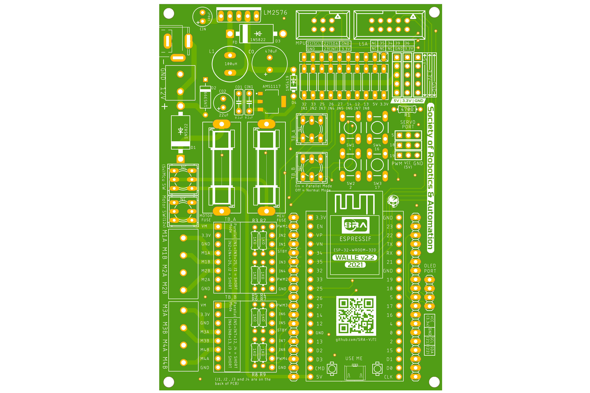

## Bottom Silkscreen

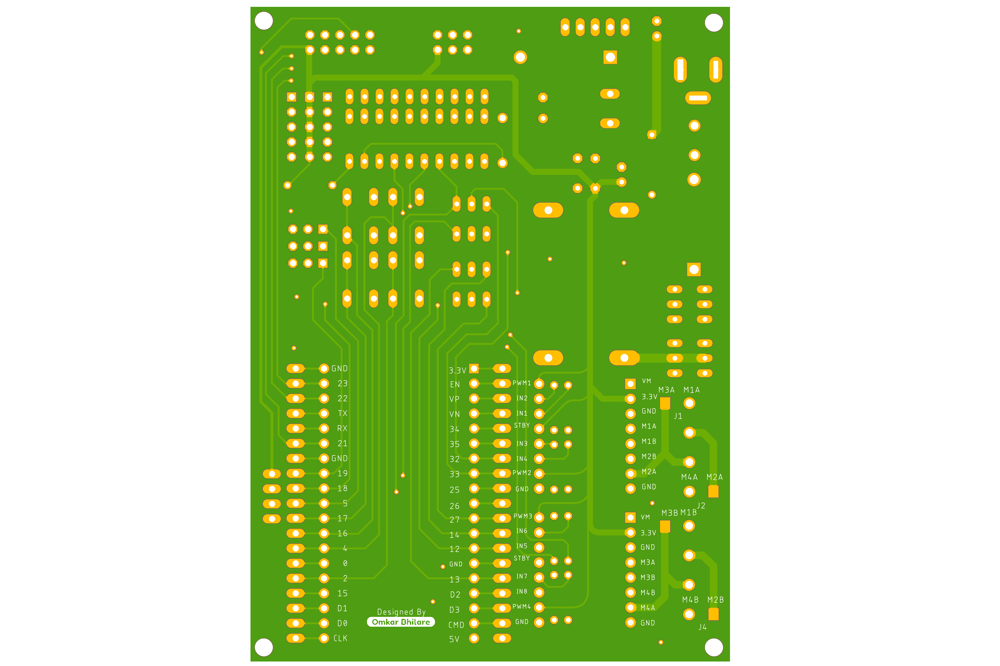

## Top Layer

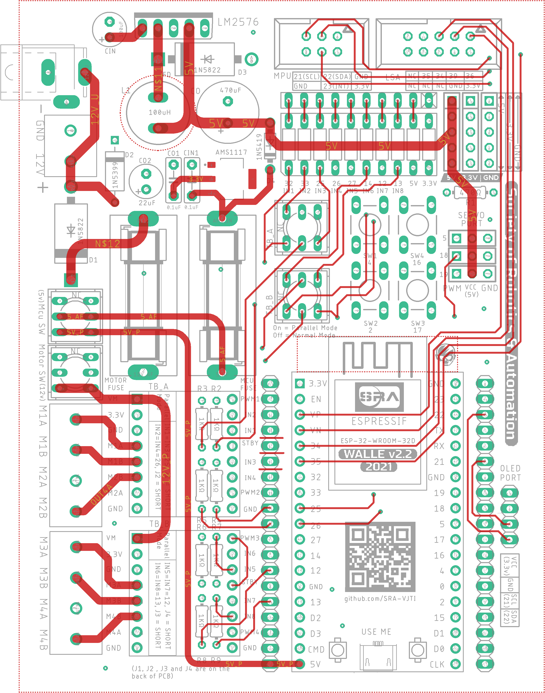

## Bottom Layer

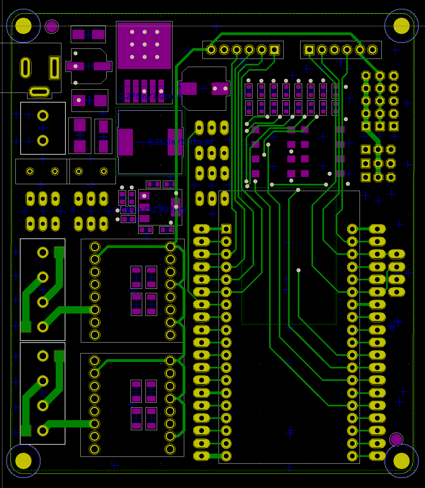

## Both Layers

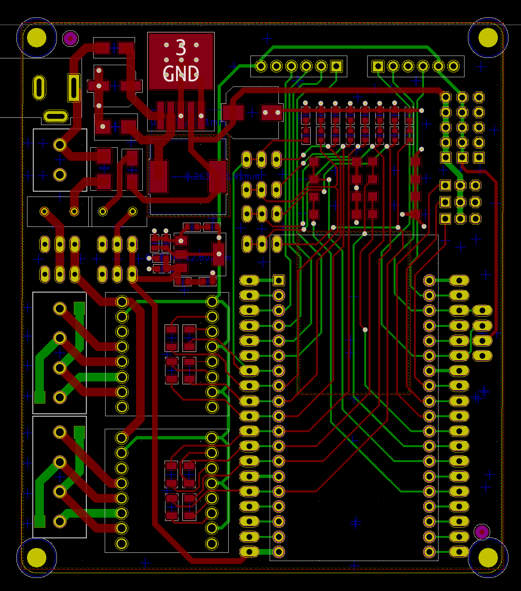

## Top Layer with Polygon

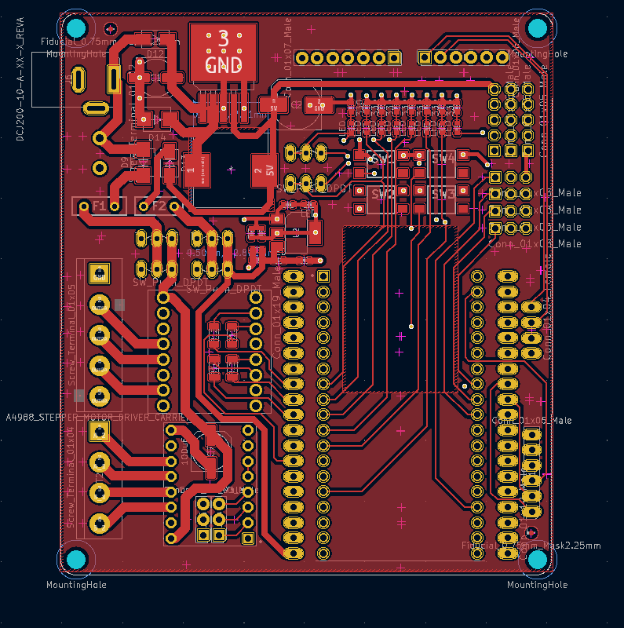

## Bottom Layer with Polygon

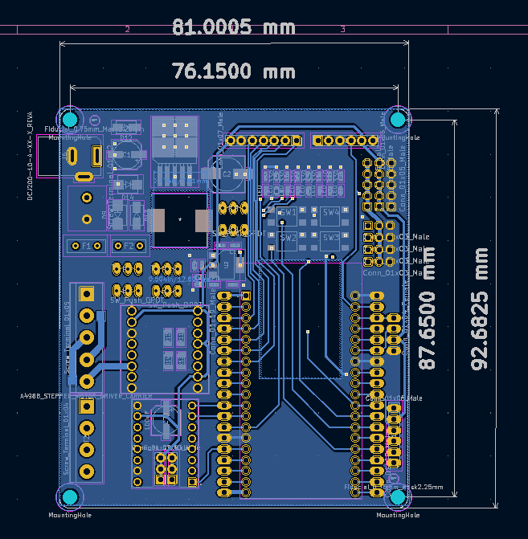

## Front

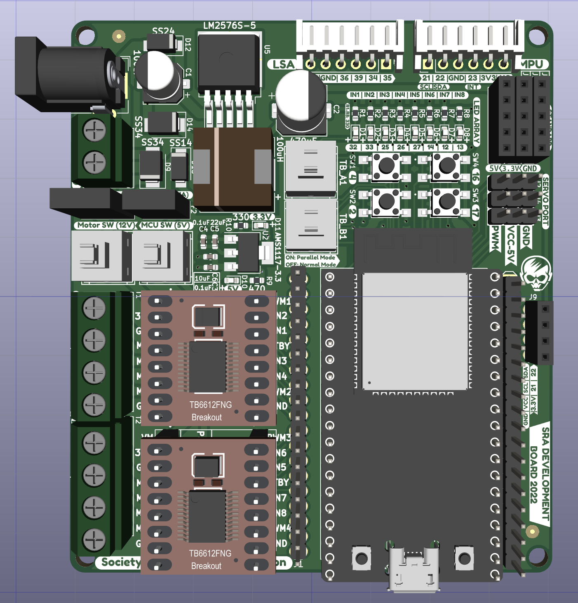

    
    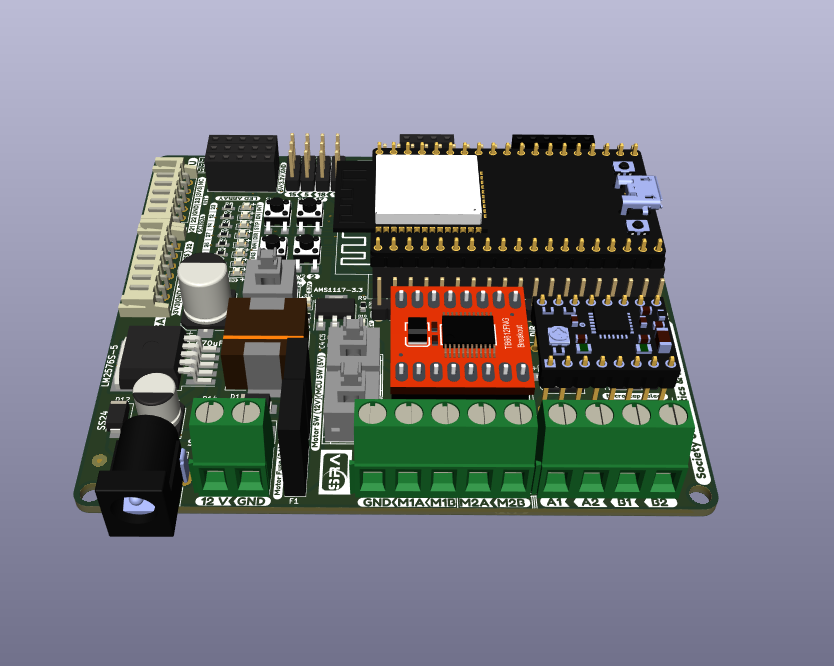

 

### 3d View

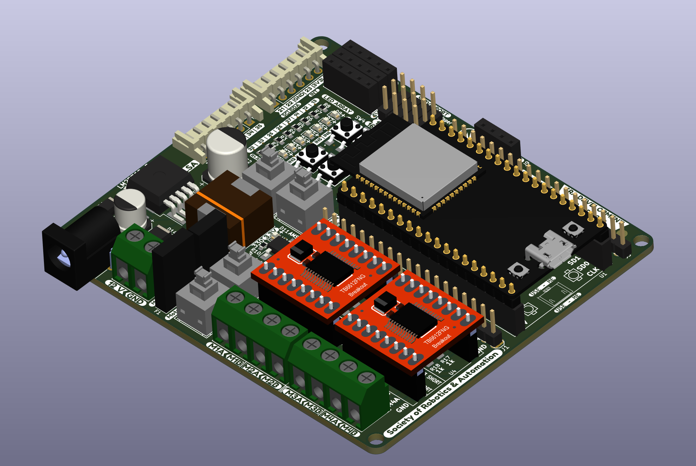

### Bottom View

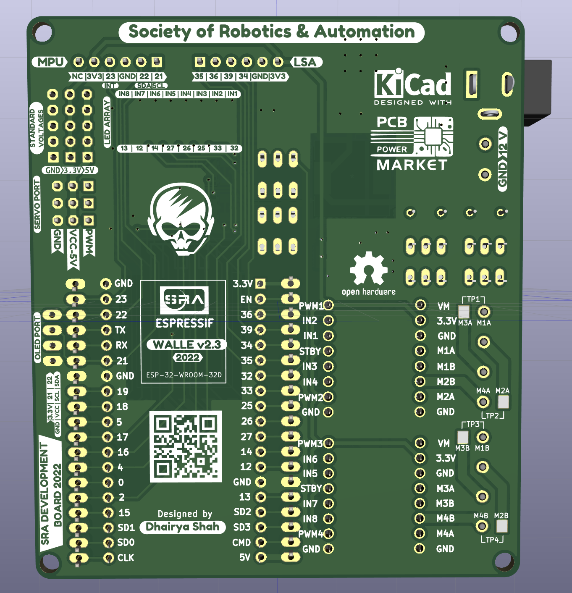

