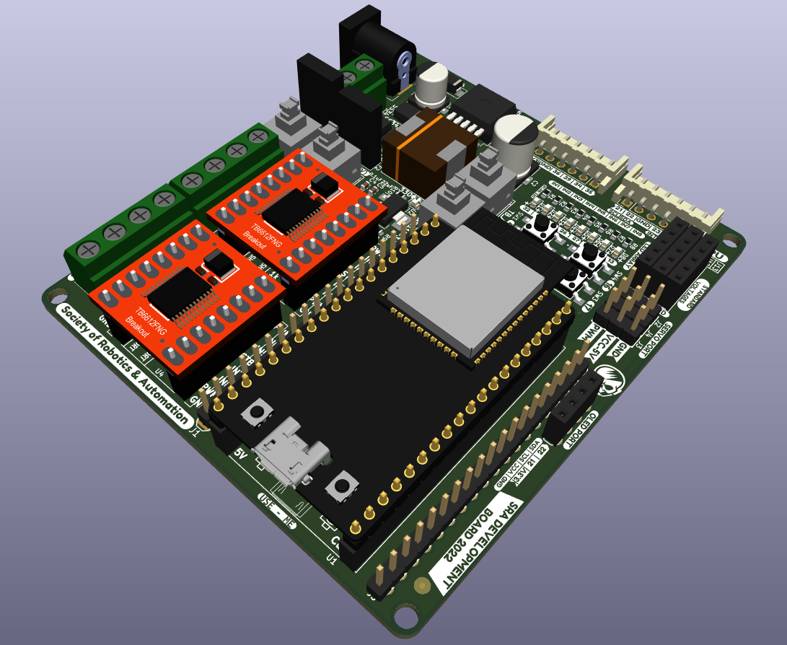

# SRA Board 2022: Images

## Schematic image

## Top Silkscreen

## Bottom Silkscreen

## Top Layer

## Bottom Layer

## Both Layers

## Top Layer with Polygon

## Bottom Layer with Polygon

## Front

    
    

 

### 3d View

### Bottom View

