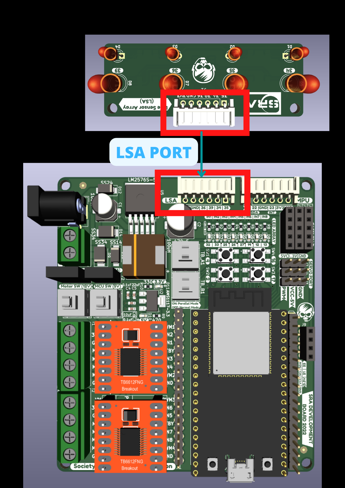

## LSA - Light Sensor Array

### Table of Contents
* [Overview](#overview)
* [Features](#features)
* [Components of LSA](#components-of-lsa)
* [Function of Components](#function-of-components)
	* [LED](#function-of-components)
	* [PhotoDiode](#function-of-components)
	* [IC LM324](#function-of-components)
	* [Resistors](#function-of-components)
* [Connections](#connections)
* [Working Principle](#working-principle)
* [Appplications](#applications)
* [Scope of Improvement](#scope-of-improvement)

### Overview 
- The Light Sensor Array(LSA) is used to detect the white/black lined surface and it sends this data to the microcontroller ESP-32. Analyzing and processing the data received by the microcontroller ESP-32, the purpose of line following is achieved.

- Physical PCB

- PCB Backside

### Features
* Components used are readily available.
* Easy connections for output signals.
* Compact enough to fit into any project.
* Distinguished trace widths for Signal and Power Routes.

### Components of LSA
| Component   | Description   | Quantity |
| ----------- | ------------- | -------- |
| LED         | Emits light   |  4       |
| PhotoDiode  | Absorbs light |  4       |
| IC LM324    | Op.Amp. IC    |  1       |  
| Resistors   | Limit Current |  8       |
|JST Connector | Connect PCB with other circuits|1|

### Function of Components
- LED
	- LSA consists of Four LED and PhotoDiode Pairs. The specific LED's emit white light which is incident on the surface and some of it is absorbed by the surface. The voltage source For the LEDs to glow is VCC.

- PhotoDiode
	- Based upon the reflectivity coefficient of the surface( generally less than 1), the remaining light reflected from the surface is captured by the Photodiodes. LEDs and complimentary photodiodes are used to efficiently detect the surface (white/black line) as the environment also contains unwanted light for the LSA sensor. The amount of light received is directly proportional to the current generated by it. More the light, more the current, more the reading.
 
- IC LM324 
	- This is a Quad(4) OP.Amp. IC. Op.Amp i.e Operation Amplifiers amplify the current with constant volatge. Since the current reading from photo diodes is significantly small and difficult to compare, it needs to be amplified. The 4 amplified outputs serve as raw readings of LSA.

- Resistors
	- Now to limit the current and thus to protect the LEDs, PhotoDiodes current limiting resistors are used.

### Connections
To connect LSA with the SRA Board, connect the JST connector in the following way:

 

### Working Principle
- LSA works on the principle of reflectivity of light for different types of surfaces.
	- Black Surface -> HIGH absorptivity -> LESS reflectivity
	- White Surface -> LOW absorptivity -> HIGH reflectivity
- Demonstration

 

### Applications
* Obstacle detection on a clear path.
* Line Following.
* Distinguish Colours on a path.

### Scope of Improvement
- LSA sometimes provides slightly inaccurate readings due to external light and conditions due to non uniformity of the colour of the path. Therefore, LSA has low accuracy. Hence LSA should be kept close to the ground.
- As of now only white and black surfaces are being mapped. Given accurate sensors and proper mapping we can map LSA for any range of RGB colours.

